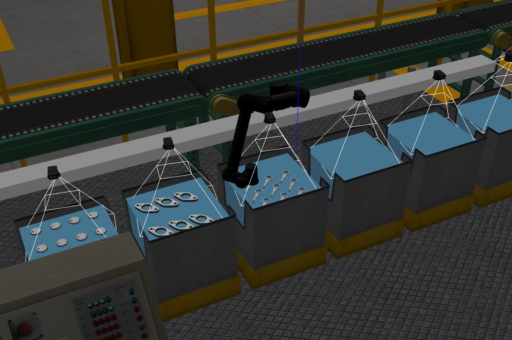

# Ariac Entry
This package will complete the necessary preliminary features to attempt the ariac challenge

## Function
This packages has an executable which will initialize the competition, use the Orders service to detect products to be found, and use the Material Locations service to determine where they are. This package uses the logical camera data to find the exact Pose of the products, and the tf2_ros package to transform those coordinates into the perspective of the robot arm. This package will then use the ik_service to determine the joint angles necessary for the robot to move to the goal position. Finally, it will compile those angles into the proper format and direct the robot to move along the desired path using the proper trajectory command topic.

The final state of the robot should look like this:

## How to use
This package can be run using the following instructions
1. Clone this package into a catkin repository
2. Verify that ecse_373_ariac and cwru_ariac_2019 are also installed
3. Initialize the ros environment
> source /opt/ros/noetic/setup.bash
4. Run the following in all three of the above directories
> source devel/setup.bash
5. Run the package using the launch file
> roslaunch ariac_entry entry.launch 
6. Press play (if necessary) on the gazebo simulation